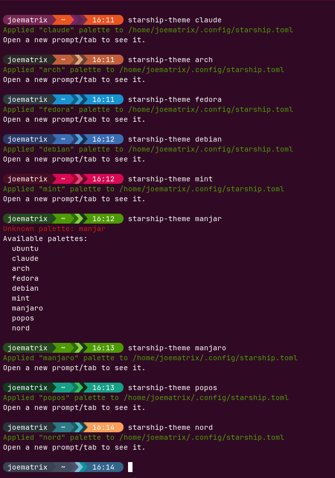

# SECDOC mybash (Linux/macOS)


## Overview

This is the SECDOC downstream distribution of [ChrisTitusTech/mybash](https://github.com/ChrisTitusTech/mybash). It tracks current upstream behavior while retaining SECDOC's nano preference, funding metadata, dense Fastfetch layout, Alacritty profile, and branded prompt. Upstream authorship and the MIT license are preserved.

The default SECDOC presentation uses Fastfetch's auto-detected operating-system ASCII logo in a high-density two-column layout. Pop!_OS systems retain the slash-and-76 logo shown in the screenshot, while other Linux distributions and macOS render the matching builtin logo for the detected operating system. The SECDOC yellow and orange logo overrides remain consistent across platforms. The inventory reports host, hardware, storage with full disk mount-point labels, memory, audio, displays, network, desktop environment, shell, OS, kernel, packages, and uptime. The compact Starship prompt conditionally displays Git state, non-zero exit status, background jobs, long command duration, and time.

## Continuous Integration

GitLab CI runs ShellCheck and the SECDOC theme contract on the isolated `phase4-untrusted` runner. The job installs its test dependencies inside a disposable rootless Podman container through Nexus. It does not install packages on the runner host or require direct Internet access. GitHub Actions remains a downstream provider-specific check for the GitHub availability mirror.

## Table of Contents

- [Installation](#installation)
- [Continuous Integration](#continuous-integration)
- [Switching Color Palettes](#switching-color-palettes)
- [Uninstallation](#uninstallation)
- [Configuration Files](#configuration-files)
  - [.bashrc](#bashrc)
  - [starship.toml](#starshiptoml)
  - [config.jsonc](#configjsonc)
  - [alacritty.toml](#alacrittytoml)
- [Key Features](#key-features)
- [Advanced Functions](#advanced-functions)
- [System-Specific Configurations](#system-specific-configurations)
- [Conclusion](#conclusion)

## Installation

To install the `.bashrc` configuration, execute the following commands in your terminal:

```sh
git clone --depth=1 https://github.com/secdoc/mybash.git
cd mybash
./setup.sh
```

The `setup.sh` script automates the installation process by:

- Creating necessary directories under `~/.local/share/mybash` and `~/.config`
- Copying the managed repository files into `~/.local/share/mybash`
- Installing Homebrew on macOS if it is not already installed
- Installing Bash 5 with Homebrew on macOS
- Adding Homebrew Bash to `/etc/shells` and setting it as the default login shell on macOS
- Installing dependencies (bash-completion, bat, neovim, starship, fzf, zoxide)
- Installing Starship and JetBrainsMono Nerd Font on Linux
- Selecting JetBrainsMono Nerd Font in Ptyxis or GNOME Terminal when available
- Installing the MesloLGS Nerd Font required for the prompt on macOS when available
- Linking configuration files from `~/.local/share/mybash` to your home directory
- Linking the fastfetch config to `~/.config/fastfetch/config.jsonc`
- Linking the dense Alacritty profile to `~/.config/alacritty/alacritty.toml`
- Applying the SECDOC Starship palette non-interactively
- Ensuring `~/.bash_profile` initializes Homebrew on macOS
- Ensuring `~/.bash_profile` sources `~/.bashrc` on macOS
- Setting up additional utilities like `fastfetch`

On macOS, `setup.sh` may prompt for your password when it adds Homebrew Bash to `/etc/shells` and changes your default shell. Restart Terminal after installation, then verify with:

```sh
echo "$SHELL"
bash --version
```

`$SHELL` should point to the Homebrew Bash path, such as `/opt/homebrew/bin/bash` on Apple Silicon or `/usr/local/bin/bash` on Intel Macs. On Linux, ensure you have the required permissions and a supported package manager.

## Switching Color Palettes

Use `starship-theme` to recolor the prompt without changing its layout:

```bash
starship-theme          # interactive picker
starship-theme secdoc   # restore the SECDOC default
starship-theme fedora   # apply a palette directly
starship-theme list     # list available palettes
```

Available palettes include SECDOC, Ubuntu, Claude, Arch, Fedora, Debian, Mint, Manjaro, Pop!_OS, Kali, Gentoo, Dracula, and the original Nord theme. Applying a palette repeatedly is idempotent and does not change prompt layout.

The SECDOC palette uses charcoal `#161616`, near-white `#F7F7F7`, yellow `#FFCC57`, orange `#EF802F`, lime `#EDF577`, magenta `#DB5192`, and neutral grays. Lime represents healthy utilization, magenta is reserved for warnings, and orange marks exceptional values such as audio above 100 percent.



## Uninstallation

To uninstall the `.bashrc` configuration, run:

```sh
cd mybash
chmod +x uninstall.sh
./uninstall.sh
./uninstall.sh --keep-deps
```

Use `--keep-deps` to remove the mybash configuration while retaining installed software and fonts.

The `uninstall.sh` script reverses the installation process by:

- Removing installed dependencies
- Uninstalling fonts
- Removing symbolic links to configuration files
- Restoring the `.bashrc` backup created during installation
- Restoring previous Ptyxis or GNOME Terminal font settings
- Deleting the `~/.local/share/mybash` directory
- Cleaning up additional utilities like `starship`, `fzf`, and `zoxide`

After running the script, it's recommended to restart your shell to apply the changes.

## Configuration Files

### `.bashrc`

The `.bashrc` file defines aliases, functions, and environment variables to enhance your shell experience. Key features include:

- **Aliases**: Shortcuts for common commands (e.g., `alias cp='cp -i'`)
- **Functions**: Custom functions for tasks like extracting archives and copying files with progress
- **Enhanced `cat` output**: Typing `cat` invokes `batcat --paging=never --style=full` on Debian-family systems, or `bat` with the same options on other supported platforms. Full style keeps bat's file header, grid, line numbers, and terminal-aware colors visible even for plain-text files such as ping output, while `--paging=never` returns directly to the prompt. Setup verifies the alias and ensures Linux and macOS Bash login shells source the installed `.bashrc`. Use `\cat` or `command cat` to bypass the alias.

### `starship.toml`

The `starship.toml` file configures the [Starship](https://starship.rs/) prompt, providing a highly customizable and informative shell prompt. It includes:

- **Theme Settings**: Defines colors and symbols for different prompt segments
- **Module Configurations**: Customizes modules like `python`, `git`, `docker_context`, and various programming languages
- **Format Customization**: Structures the layout and truncation of paths for a cleaner look

### `config.jsonc`

The `config.jsonc` file configures [fastfetch](https://github.com/AlexRogalskiy/fastfetch), a system information tool. It includes:

- **Logo and Display Settings**: Auto-detects the operating system's builtin ASCII logo while applying SECDOC colors, padding, and separators
- **Modules**: Defines which system information modules to display, such as CPU, GPU, OS, kernel, and uptime
- **Custom Sections**: Adds custom formatted sections for hardware and software information

### `alacritty.toml`

The Alacritty profile maps ANSI semantic colors to the exact SECDOC palette, uses JetBrainsMono Nerd Font to match the installer, and minimizes padding for the approved dense layout. Because Fastfetch emits semantic ANSI colors, the same roles remain consistent across system information and shell output.

## Key Features

1. **Aliases and Functions**
   - Shortcuts for common commands
   - Custom functions for complex operations (e.g., extracting archives, copying with progress)

2. **Prompt Customization and History Management**
   - Configures PROMPT_COMMAND for automatic history saving
   - Manages history file size and handles duplicates

3. **Enhancements and Utilities**
   - Improves command output readability with colors
   - Uses `batcat` or `bat` for interactive `cat` output without changing normal non-interactive script execution
   - Introduces safer file operations (e.g., using `trash` instead of `rm`)
   - Integrates Zoxide for easy directory navigation

4. **Installation and Configuration Helpers**
   - Auto-installs necessary utilities based on system type
   - Provides functions to edit important configuration files

## Advanced Functions

- System information display
- Networking utilities (e.g., IP address checks)
- Resource monitoring tools

## System-Specific Configurations

- Editor settings (nano as the SECDOC default, with upstream fallbacks when unavailable)
- Conditional aliases based on system type
- Package manager-specific commands

## Conclusion

This `.bashrc` configuration offers a powerful and customizable terminal environment suitable for various Unix-like systems. It enhances productivity through smart aliases, functions, and integrated tools while maintaining flexibility for system-specific needs. Whether you're a developer, system administrator, or power user, this setup aims to make your terminal experience more efficient and enjoyable.

For any issues, suggestions, or contributions, please open an issue or pull request in this repository. We welcome community involvement to make this configuration even better!
